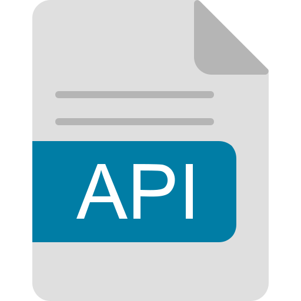

[](https://github.com/eclipse-zenoh/zenoh-java/actions/workflows/ci.yml)
[](https://github.com/eclipse-zenoh/zenoh-java/actions/workflows/release.yml)
[](https://github.com/eclipse-zenoh/roadmap/discussions)
[](https://discord.gg/2GJ958VuHs)
[](https://choosealicense.com/licenses/epl-2.0/)
[](https://opensource.org/licenses/Apache-2.0)

# Eclipse Zenoh

The Eclipse Zenoh: Zero Overhead Pub/sub, Store/Query and Compute.

Zenoh (pronounce _/zeno/_) unifies data in motion, data at rest and computations. It carefully blends traditional pub/sub with geo-distributed storages, queries and computations, while retaining a level of time and space efficiency that is well beyond any of the mainstream stacks.

Check the website [zenoh.io](http://zenoh.io) and the [roadmap](https://github.com/eclipse-zenoh/roadmap) for more detailed information.

----

#   Java API

This repository provides a Java compatible Kotlin binding based on the main [Zenoh implementation written in Rust](https://github.com/eclipse-zenoh/zenoh).

The code relies on a native library written in Rust, communicating with the Kotlin layer through the Java Native Interface (JNI). That library is not built in this repository: it is generated and published separately as [zenoh-flat-jni](https://github.com/eclipse-zenoh/zenoh-flat-jni) and consumed here as an ordinary Maven dependency.

##  Documentation

The documentation of the API is published at [https://eclipse-zenoh.github.io/zenoh-java/index.html](https://eclipse-zenoh.github.io/zenoh-java/index.html).

Alternatively, you can build it locally as [explained below](#building-the-documentation).

----

# How to import

##   Android

First add the Maven central repository to your `settings.gradle.kts`:

```kotlin
dependencyResolutionManagement {
    // ...
    repositories {
        mavenCentral()
    }
}
```

After that add to the dependencies in the app's `build.gradle.kts`:

```kotlin
implementation("org.eclipse.zenoh:zenoh-java-android:1.9.0")
```

### Platforms

The library targets the following platforms:

- x86
- x86_64
- arm
- arm64

### SDK

The minimum SDK is 30.

### Permissions

Zenoh is a communications protocol, therefore the permissions required are:

```xml
<uses-permission android:name="android.permission.INTERNET"/>
<uses-permission android:name="android.permission.ACCESS_NETWORK_STATE"/>
```

##  JVM

The Zenoh library can be added as both a Gradle dependency or a Maven dependency.

### Gradle 
To import the library as a Gradle dependency, add the Maven central repository to your `settings.gradle.kts`:

```kotlin
dependencyResolutionManagement {
    // ...
    repositories {
        mavenCentral()
    }
}
```

After that add to the dependencies in the app's `build.gradle.kts`:

```kotlin
implementation("org.eclipse.zenoh:zenoh-java:1.9.0")
```
### Maven Dependency

To add the library in a Maven project, add it as a dependency under the <dependencies> tag in the project's `pom.xml`:

```xml
    </dependencies>
        <!-- All other dependencies -->

        <!-- Added Zenoh dependency -->
        <dependency>
            <groupId>org.eclipse.zenoh</groupId>
            <artifactId>zenoh-java</artifactId>
            <version>1.9.0</version>
            <!--  Or the latest version available at https://mvnrepository.com/artifact/org.eclipse.zenoh/zenoh-java -->
        </dependency>
    </dependencies>
```
Thereafter, recompile the project with the added dependency:
```bash
    mvn package
```

### Platforms

For the moment, the library targets the following platforms:

- x86_64-unknown-linux-gnu
- aarch64-unknown-linux-gnu
- x86_64-apple-darwin
- aarch64-apple-darwin
- x86_64-pc-windows-msvc
- aarch64-pc-windows-msvc

----

# How to build it

## What you need

Basically:

- Kotlin ([Installation guide](https://kotlinlang.org/docs/getting-started.html#backend))

and in case of targeting Android you'll also need:

- Android SDK ([Installation guide](https://developer.android.com/about/versions/11/setup-sdk))

## Gradle wrapper

This repository ships a [Gradle wrapper](https://docs.gradle.org/current/userguide/gradle_wrapper.html) (`./gradlew` / `gradlew.bat`), so no system-wide Gradle installation is required. The wrapper pins the build to **Gradle 8.12.1** and verifies the distribution checksum before use, ensuring a reproducible and tamper-evident build environment.

Use `./gradlew` on Unix/macOS/Linux (or `gradlew.bat` on Windows) in place of `gradle` for all commands listed below.

The native libraries are not built here — they arrive inside the
`org.eclipse.zenoh:zenoh-flat-jni` dependency, so no Rust toolchain is needed.
Building against that repository's source instead does need one — see below.
Releasing is documented in [PUBLISHING.md](PUBLISHING.md).

## Where the native library comes from

Three ways to build. Pick by what you are doing:

| I want to… | build with | Rust needed |
| --- | --- | --- |
| just build or use the SDK | `./gradlew build` | no |
| build the bindings from source too | `./gradlew build -PuseLocalJni=true` | yes |
| build against my own checkout | `./gradlew build -PlocalJniDir=../zenoh-flat-jni` | yes |

**The default** downloads `org.eclipse.zenoh:zenoh-flat-jni` with the native
library already inside it. Nothing is compiled from Rust and no toolchain is
needed. On `main` that is `1.9.0-java-SNAPSHOT`, published from this repository
alongside the SDK snapshot ([CI.md](CI.md#what-publishing-uses)); a release
names a zenoh-flat-jni release on Maven Central. Either way it is one coordinate
in `gradle.properties`, and if it has not been published yet the other two rows
build without it.

**`-PuseLocalJni=true`** builds the bindings from source, as `Cargo.toml`
says — the usual Rust arrangement, and the one CI uses. A `git` dependency there
means the exact commit recorded in `Cargo.lock` (resolved on the spot if there is
no lockfile yet); a `path` means that directory. So

```bash
./gradlew jvmTest -PuseLocalJni=true
```

reproduces a CI run exactly. See [CI.md](CI.md) for how that commit is chosen and
kept current.

**`-PlocalJniDir=<path>`** points straight at a checkout, no `Cargo.toml` involved.
Use it to try a branch or a scratch copy without editing anything.

Both source options need a Rust toolchain ([rustup.rs](https://rustup.rs));
Gradle drives cargo for you. To work further down the stack — on `zenoh-flat` or
`zenoh` themselves — edit inside your `zenoh-flat-jni` checkout, whose own
`Cargo.toml` points at them the same way.

Releases always use the first option; see [PUBLISHING.md](PUBLISHING.md).

##  JVM

To publish a library for a JVM project into Maven local, run

```bash
./gradlew publishJvmPublicationToMavenLocal
```

This compiles the Kotlin and publishes the library into Maven local. No native
code is built here: the native libraries arrive inside the
`org.eclipse.zenoh:zenoh-flat-jni` dependency, already cross-compiled for every
supported desktop target, so the result is not tied to the machine that built it.

Once we have published the package, we should be able to find it under `~/.m2/repository/org/eclipse/zenoh/zenoh-java/1.9.0`.

Finally, in the gradle file of the project where you intend to use this library, add mavenLocal to the list of repositories and add zenoh-java as a dependency:

```kotlin
repositories {
    mavenCentral()
    mavenLocal()
}

dependencies {
    implementation("org.eclipse.zenoh:zenoh-java:1.9.0")
}
```

##  Android

To use these bindings in a native Android project, build the Android publication,
publishing it into Maven local for us to be able to easily import it in our project.

The Android native libraries are **not** built here either: they arrive inside
the `org.eclipse.zenoh:zenoh-flat-jni-android` artifact, cross-compiled for
`armeabi-v7a`, `arm64-v8a`, `x86` and `x86_64` by that repository's release. No
NDK or Rust Android target is needed to build this SDK.

To publish the library onto Maven Local, run:

```bash
./gradlew -Pandroid=true publishAndroidReleasePublicationToMavenLocal
```

This will first trigger the compilation of the Zenoh-JNI for the previously mentioned targets, and secondly will
publish the library. The Android native binaries are not produced here — they
come from the `zenoh-flat-jni-android` dependency.

You should now be able to see the package under `~/.m2/repository/org/eclipse/zenoh/zenoh-java-android/1.9.0`.

Finally, in the gradle file of the project where you intend to use this library, add mavenLocal to the list of repositories and add zenoh-java-android as a dependency:

```kotlin
repositories {
    mavenCentral()
    mavenLocal()
}

dependencies {
    implementation("org.eclipse.zenoh:zenoh-java-android:1.9.0")
}
```

Reminder that in order to work during runtime, the following permissions must be enabled in the app's manifest:

```xml
<uses-permission android:name="android.permission.INTERNET" />
<uses-permission android:name="android.permission.ACCESS_NETWORK_STATE" />
```

## Building the documentation

Because it's a Kotlin project, we use [Dokka](https://kotlinlang.org/docs/dokka-introduction.html) to generate the documentation.

In order to build it, run:

```bash
./gradlew dokkaGenerate
```

## Running the tests

To run the tests, run:

```bash
./gradlew jvmTest
```

This runs the tests against the JVM target. Nothing native is compiled: the
libraries come from the `zenoh-flat-jni` dependency. The two source options from
[Where the native library comes from](#where-the-native-library-comes-from)
apply here as well, and both do compile it, so both need a Rust toolchain (see
[rustup.rs](https://rustup.rs)):

```bash
./gradlew jvmTest -PuseLocalJni=true                    # the pinned commit — what CI runs
./gradlew jvmTest -PlocalJniDir=../zenoh-flat-jni       # your own checkout
```

Use the second when you are changing both repositories together — the first
tests the commit `Cargo.lock` pins, not your working tree.

## Logging

Rust logs are propagated when setting the `RUST_LOG` environment variable.

For instance running the ZPub test as follows:

```bash
RUST_LOG=debug ./gradlew ZPub
```

causes the logs to appear in standard output.

The log levels are the ones from Rust, typically `trace`, `info`, `debug`, `error` and `warn` (though other log filtering options are available, see <https://docs.rs/env_logger/latest/env_logger/#enabling-logging>).

Alternatively, the logs can be enabled programmatically through `Zenoh.initLogFromEnvOr(logfilter)`, for instance:

```kotlin
Zenoh.initLogFromEnvOr("debug")
```

----

# Examples

You can find some examples located under the [`/examples` folder](examples). Checkout the [examples README file](/examples/README.md).

----

# Old packages

Old released versions were published into Github packages.

In case you want to use one of the versions published into github packages, add the Github packages repository to your `settings.gradle.kts` as follows:

```kotlin
dependencyResolutionManagement {
    // ...
    repositories {
        google()
        mavenCentral()
        maven {
            name = "GitHubPackages"
            url = uri("https://maven.pkg.github.com/eclipse-zenoh/zenoh-java")
            credentials {
                username = providers.gradleProperty("user").get()
                password = providers.gradleProperty("token").get()
            }
        }
    }
}
```

where the username and token are your github username and a personal access token you need to generate on github with package read permissions (see the [Github documentation](https://docs.github.com/en/authentication/keeping-your-account-and-data-secure/managing-your-personal-access-tokens)).
This is required by Github in order to import the package, even if it's from a public repository.

Then after that, add the dependency as usual:

```kotlin
dependencies {
    implementation("org.eclipse.zenoh:zenoh-java:<version>")
}
```
